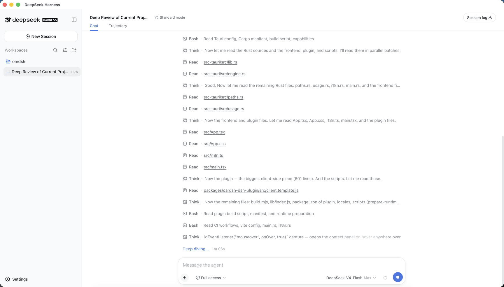

<div align="center">


# oardsh

把 [DeepSeek Harness](https://github.com/deepseek-ai/deepseek-harness) 带到桌面。

[English](README.md)

</div>



oardsh 保留 dsh Web 熟悉的体验，并补上只有原生应用才能提供的能力。所有新增内容都位于 dsh 自己的设置页中，沿用其主题、布局与语言（英语与简体中文，以英语回退），并带着应用的鲸鱼图标，因此始终能与原生 dsh 界面区分开。

- **系统通知** —— 当 dsh 等待授权、需要回答问题或完成当前回合时发送系统通知，切换到其他应用工作也不会错过需要处理的节点。
- **上下文用量悬浮查看** —— 输入框旁的上下文圆环改为鼠标悬浮即展开，面板中补充了各部分的占用百分比与剩余可用容量。dsh 的会话统计默认也收进这个面板，取代输入框下方那行会被截断的文本；**设置 → 通用设置**里有开关可以放回原位。
- **用量统计** —— 基于本地会话记录生成的看板：最近 7 天或 30 天的 tokens 用量、会话数、消息数、活跃天数与连续天数，一年跨度的活跃热力图，按模型堆叠的每日 Token 趋势，以及各模型的用量占比。

## 下载

前往 [GitHub Releases](https://github.com/GreatV/oardsh/releases) 下载对应平台的安装包 —— macOS 的 DMG（Apple Silicon 或 Intel）、Windows x64 安装程序，或 Linux x64 的 AppImage / Debian / RPM 软件包。

> macOS 与 Windows 安装包未使用商业开发者证书签名，首次启动时系统可能显示安全确认。

## 开发

```sh
npm install
npm run tauri dev     # 运行
npm run tauri build   # 构建当前平台的安装包
```
